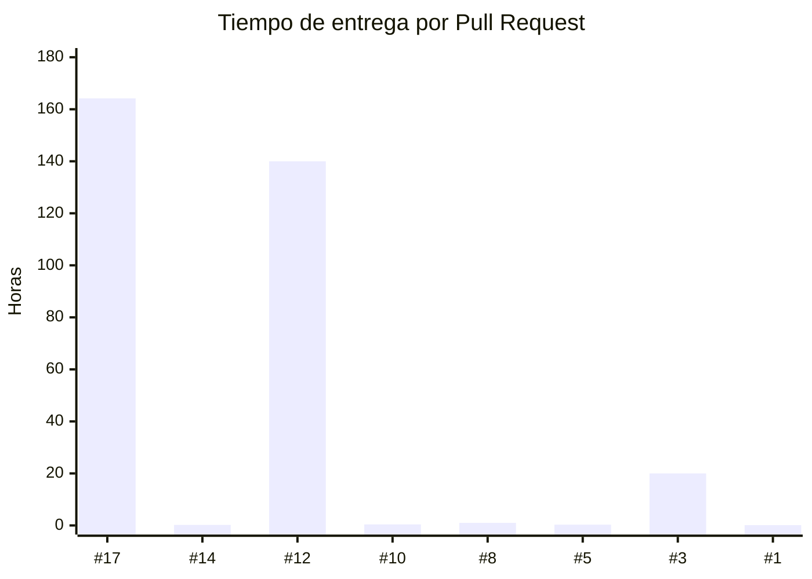

# Panel de métricas de proceso

Este panel presenta métricas obtenidas a partir del historial real del repositorio de HELA mediante la GitHub API.

Los resultados corresponden a una única ventana de observación. Cada valor reportado conserva su tamaño de muestra y los datos utilizados permanecen disponibles para su verificación.

## 1. Resumen de indicadores

| Indicador                              | Estado    | Resultado                                   |
| -------------------------------------- | --------- | ------------------------------------------- |
| Tiempo de entrega de cambios           | Calculado | Mediana: **0.7 h**, N = 8                   |
| Frecuencia de integración hacia `main` | Calculado | **0.67 integraciones/semana**, N = 2        |
| Frecuencia de despliegue               | Pendiente | Sin datos de despliegue a producción        |
| Tasa de fallos de cambios              | Pendiente | Sin datos de fallos asociados a despliegues |
| Tiempo de restauración del servicio    | Pendiente | Sin monitoreo ni registro de incidentes     |

Los dos primeros indicadores se calculan con información disponible actualmente en el repositorio. Los tres restantes requieren información de producción que todavía no se encuentra disponible.

## 2. Datos de observación

| Elemento                               | Valor                              |
| -------------------------------------- | ---------------------------------- |
| Repositorio                            | `Alex-Jeanpier-Chata/is-2026-nexo` |
| Fuente                                 | GitHub API                         |
| Fecha de extracción                    | `2026-09-15T23:09:29.007Z`         |
| Inicio de ventana                      | `2026-08-25T23:09:26.462Z`         |
| Fin de ventana                         | `2026-09-15T23:09:26.462Z`         |
| Duración                               | 21 días                            |
| Semanas observadas                     | 3                                  |
| Pull Requests cerrados consultados     | 12                                 |
| Pull Requests fusionados en la ventana | 8                                  |
| Rama principal                         | `main`                             |
| Rama de integración                    | `develop`                          |

La inclusión de un Pull Request en la muestra se determina mediante su fecha de integración (`merged_at`).

Cuando un Pull Request se integra dentro de la ventana, el cálculo del tiempo de entrega conserva la fecha real de su primer commit, aunque este se hubiera realizado antes del inicio de la ventana.

## 3. Tiempo de entrega de cambios

El tiempo de entrega de cada Pull Request se calcula mediante:

`fecha de integración - fecha del primer commit`

### Resultado

**Mediana: 0.7 horas [Ventana: 25/08/2026–15/09/2026, N = 8 Pull Requests].**

**Promedio: 40.8 horas [Ventana: 25/08/2026–15/09/2026, N = 8 Pull Requests].**

Debido al tamaño reducido de la muestra y a la presencia de valores considerablemente superiores al resto, la mediana se utiliza como referencia principal para describir el conjunto observado.

### Detalle por Pull Request

|  PR | Rama de origen                       | Rama de destino | Primer commit        | Integración          |  Tiempo |
| --: | ------------------------------------ | --------------- | -------------------- | -------------------- | ------: |
| #17 | `docs/s03-acuerdos-equipo`           | `develop`       | 09/09/2026 00:51 UTC | 15/09/2026 21:01 UTC | 164.2 h |
| #14 | `chore/s03-configuracion-git`        | `develop`       | 08/09/2026 23:50 UTC | 09/09/2026 00:01 UTC |   0.2 h |
| #12 | `develop`                            | `main`          | 02/09/2026 00:50 UTC | 07/09/2026 20:51 UTC | 140.0 h |
| #10 | `feature/s02-documentacion-equipo-9` | `develop`       | 04/09/2026 16:25 UTC | 04/09/2026 16:50 UTC |   0.4 h |
|  #8 | `feat/s02-pedido-temporal-qr`        | `develop`       | 04/09/2026 01:40 UTC | 04/09/2026 02:40 UTC |   1.0 h |
|  #5 | `chore/s02-configuracion-git`        | `develop`       | 02/09/2026 21:31 UTC | 02/09/2026 21:47 UTC |   0.3 h |
|  #3 | `docs/s02-contrato-openapi-v021`     | `develop`       | 02/09/2026 00:50 UTC | 02/09/2026 20:51 UTC |  20.0 h |
|  #1 | `docs/s02-acta-y-convenciones`       | `main`          | 02/09/2026 00:00 UTC | 02/09/2026 00:06 UTC |   0.1 h |

### Distribución del tiempo de entrega



### Lectura de los resultados

Los PR #17 y #12 presentan tiempos de entrega considerablemente superiores al resto de la muestra.

Estos valores incrementan el promedio hasta 40.8 horas, mientras que la mediana se mantiene en 0.7 horas. La diferencia entre ambas medidas evidencia una distribución asimétrica de los tiempos observados.

Los valores se conservan sin exclusiones ni modificaciones manuales.

## 4. Frecuencia de integración

La frecuencia de integración se calcula mediante:

`Pull Requests fusionados hacia la rama / semanas observadas`

### Rama principal

Durante la ventana se identificaron 2 Pull Requests fusionados hacia `main`:

* PR #12.
* PR #1.

Por tanto:

**Frecuencia de integración hacia `main`: 0.67 integraciones por semana [Ventana: 25/08/2026–15/09/2026, N = 2 Pull Requests].**

Este es el indicador principal de frecuencia utilizado en el panel.

### Rama de integración

Como información complementaria del flujo interno del equipo se identificaron 6 Pull Requests fusionados hacia `develop`:

* PR #17.
* PR #14.
* PR #10.
* PR #8.
* PR #5.
* PR #3.

Por tanto:

**Frecuencia de integración hacia `develop`: 2.00 integraciones por semana [Ventana: 25/08/2026–15/09/2026, N = 6 Pull Requests].**

Este valor permite observar la actividad de integración interna del equipo, pero se mantiene separado del indicador calculado para `main`.

### Integración y despliegue

La frecuencia de integración representa fusiones de cambios dentro del repositorio.

No representa la frecuencia de despliegue del sistema a un entorno de producción.

Por este motivo:

`frecuencia de integración ≠ frecuencia de despliegue`

La frecuencia de despliegue permanece pendiente hasta disponer de un proceso de entrega a producción que genere información verificable.

## 5. Indicadores pendientes

Los siguientes indicadores no reciben valores numéricos porque el proyecto todavía no dispone de la infraestructura necesaria para medirlos con datos verificables.

| Indicador                           | Estado    | Información faltante                                                          | Activación prevista |
| ----------------------------------- | --------- | ----------------------------------------------------------------------------- | ------------------- |
| Frecuencia de despliegue            | Pendiente | Registro automatizado de despliegues reales hacia producción                  | Semana 16           |
| Tasa de fallos de cambios           | Pendiente | Relación entre despliegues y fallos, degradaciones o correcciones posteriores | Semana 16           |
| Tiempo de restauración del servicio | Pendiente | Monitoreo, registro de incidentes y marcas temporales de recuperación         | Semana 16           |

### Frecuencia de despliegue

Actualmente no existe un proceso de despliegue a producción registrado de forma automatizada.

Las fusiones hacia `main` no se consideran despliegues y, por tanto, no se utilizan para asignar un valor a este indicador.

### Tasa de fallos de cambios

Actualmente no existen registros de producción que permitan determinar qué despliegues provocaron fallos, degradaciones del servicio o acciones correctivas.

Sin esta relación no es posible obtener una tasa verificable.

### Tiempo de restauración del servicio

Actualmente no existe monitoreo de producción ni un registro formal de incidentes que permita identificar el momento de una interrupción y el momento de restauración del servicio.

Por esta razón tampoco existe una muestra sobre la cual calcular este indicador.

No se asignan valores estimados, valores cero ni aproximaciones a los indicadores pendientes.

## 6. Fuente y trazabilidad

La obtención y procesamiento de los datos se realiza mediante los siguientes artefactos:

**`scripts/metricas-dora.js`.** Consulta la GitHub API, filtra los Pull Requests fusionados dentro de la ventana, obtiene el primer commit de cada PR y calcula las métricas disponibles.

**`docs/proceso/panel-metricas/metricas_raw.json`.** Conserva la información extraída, las marcas temporales utilizadas, los Pull Requests incluidos en la muestra y los resultados derivados.

**`docs/proceso/panel-metricas/README.md`.** Presenta los resultados, las tablas de cálculo, la visualización y el estado de los indicadores pendientes.

La información se obtiene de forma programática mediante la GitHub API. Los datos generados no deben modificarse manualmente para alterar los resultados.

Para realizar una nueva extracción se ejecuta:

```bash
node scripts/metricas-dora.js
```

Cada ejecución consulta nuevamente el repositorio y genera los resultados correspondientes a la ventana temporal configurada.

## Referencias

* Forsgren, N., et al. (2023). *Metrics for Agile Teams (The DORA Metrics)*. DORA State of DevOps Report.
* IEEE Computer Society. (2024). *Guide to the Software Engineering Body of Knowledge (SWEBOK Guide) v4.0*, §7.
* Universidad Nacional Jorge Basadre Grohmann. (2026). *Sílabo de Ingeniería de Software I, 2026-II*.
